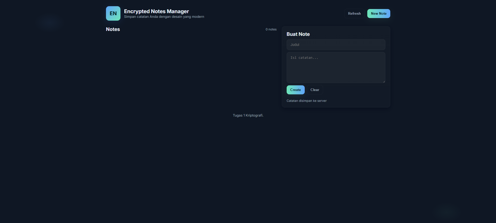
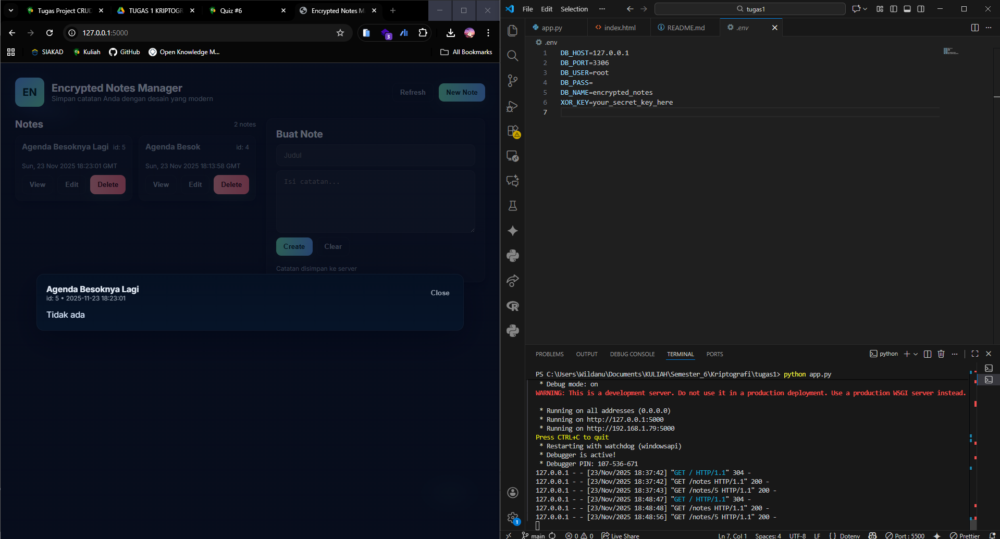
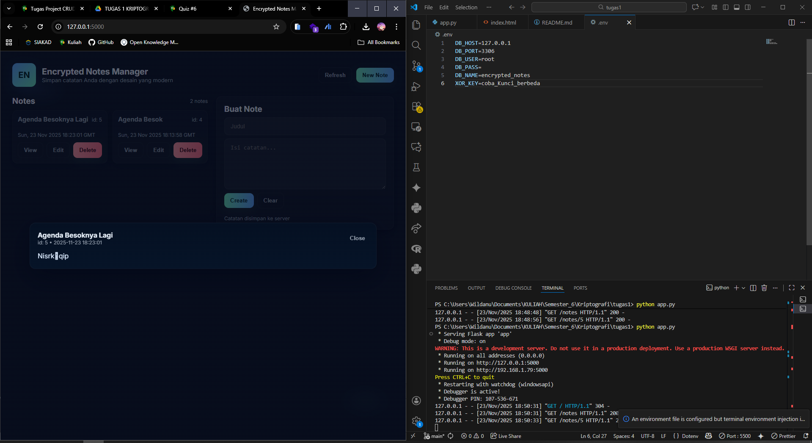

# Encrypted Notes Manager


Aplikasi sederhana yang melakukan operasi CRUD pada database MySQL sambil mengenkripsi field `content` menggunakan cipher Stream XOR . Proyek ini untuk tujuan pembelajaran — **jangan** gunakan cipher ini di lingkungan produksi.

## Fitur
- Buat, Baca, Perbarui, Hapus catatan
- Konten disimpan terenkripsi dengan stream XOR
- Frontend web sederhana

## Percobaan
Pada Gambar Dibawah Ini Menunjukan Dimana Menggunakan Kunci Aslinya Dan Catatan/Plaintext Dapat Terbaca Dengan Normal/Tertata



Dan Pada Gambar Dibawah Ini Ketika Saya Mencoba Ganti Kuncinya yang tidak sesuai Maka Tampilan Catatan/Plaintext Berubah Tidak Dapat Dibaca Dengan Normal



## Penjelasan Implementasi XOR pada Kode

Pada aplikasi ini, proses enkripsi dan dekripsi dilakukan dengan fungsi `xor_stream_bytes`:

```python
def xor_stream_bytes(data: bytes, key: bytes) -> bytes:
    if not key:
        raise ValueError('Empty key')
    out = bytearray(len(data))
    klen = len(key)
    for i, b in enumerate(data):
        out[i] = b ^ key[i % klen]
    return bytes(out)
```
### Penjelasan langkah-langkahnya:

- data dan key diubah menjadi array byte agar dapat diproses per karakter.
- for `i`, `b in` `enumerate(data)` melakukan perulangan pada setiap byte plaintext (atau ciphertext).
- `i % klen` memastikan kunci digunakan berulang sepanjang data (stream cipher).
- Operasi inti adalah `b ^ key[...]` yaitu operasi XOR antara byte data dan byte kunci.
- Hasil XOR disimpan ke out, lalu dikembalikan sebagai bytes.
- Karena sifat XOR yang reversible, fungsi ini digunakan dua arah:
- Enkripsi: cipher = XOR(plaintext, key)
- Dekripsi: plaintext = XOR(cipher, key)

Sehingga proses enkripsi dan dekripsi memakai fungsi yang sama. Enkripsi diterapkan di fungsi `encrypt_text()`, dan dekripsi di `decrypt_bytes()`.

## Persyaratan
- Python 3.8+
- MySQL / MariaDB

## Persiapan
### Lakukan Clone
```
git clone https://github.com/wildanuwr/Encrypted-Note-Manager.git
```
1. Buat database dan tabel:
    ```bash
    mysql -u root -p < sql/dump_notes.sql
    ```
2. Buat virtualenv dan install dependency:
    ```bash
    copy env.example ke .env
    pip install -r requirements.txt
    ```
3. Export variabel lingkungan:
    pada file `.env` Sesuaikan Dengan Db Yang digunakan
    ```bash
    export DB_HOST=127.0.0.1
    export DB_PORT=3306
    export DB_USER=root
    export DB_PASS=yourpassword
    export DB_NAME=encrypted_notes
    export XOR_KEY="kunci_rahasia"
    ```
    (Di Windows gunakan cara yang sesuai untuk mengatur environment variables)
4. Jalankan aplikasi:
    ```bash
    python app.py
    ```
5. Buka `http://127.0.0.1:5000/` untuk menggunakan frontend, atau gunakan curl/Postman untuk memanggil API.

## Endpoint API
- `GET /notes` — daftar catatan (metadata)
- `GET /notes/<id>` — ambil dan dekripsi isi catatan
- `POST /notes` — buat catatan `{title, content}`
- `PUT /notes/<id>` — perbarui (title dan/atau content)
- `DELETE /notes/<id>` — hapus catatan

## Catatan Keamanan
- Stream XOR pada repo ini sengaja dibuat untuk tujuan tugas matakuliah kriptografi dan steganografi. Kelemahan:
  - Menggunakan kembali kunci dapat membocorkan informasi
  - Tidak ada autentikasi / tidak ada pemeriksaan integritas
  - Panjang kunci berpengaruh pada keamanan
- Untuk sistem produksi, gunakan AES-GCM atau mode enkripsi terautentikasi lainnya.

